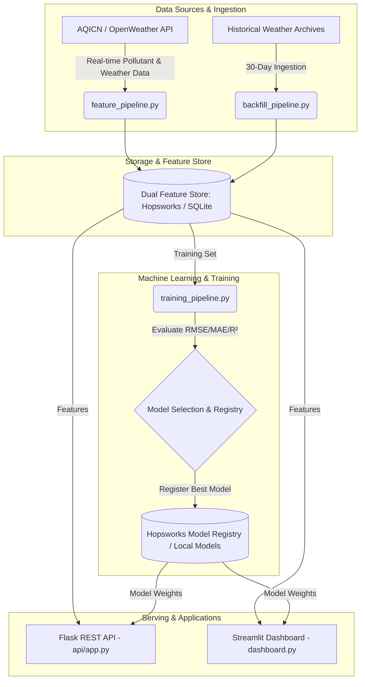

# 🌤️ Pearls AQI Predictor

[](https://github.com/ridaeman02/10pearls-aqi-predictor/actions/workflows/feature_pipeline.yml)
[](https://github.com/ridaeman02/10pearls-aqi-predictor/actions/workflows/training_pipeline.yml)
[](https://www.python.org/)
[](https://opensource.org/licenses/MIT)

**Enterprise-Grade 100% Serverless MLOps System | 10Pearls Internship Project**

An end-to-end serverless Machine Learning forecasting system that predicts the **Air Quality Index (AQI)** for **Islamabad, Pakistan** for the next 3 days (24h, 48h, and 72h lead-times) using real-time weather metrics, pollutant features ($PM_{2.5}, PM_{10}, NO_2$), time-series feature engineering, and automated multi-model selection (Scikit-learn Random Forest, Ridge Regression, and TensorFlow Deep Learning).

---

## 🏛️ System Architecture



---

## 📊 Model Comparison Matrix

Models are trained on chronological time-series splits ($80/20$) and evaluated on multi-step target horizons (24h, 48h, 72h). The training pipeline automatically selects the model with the lowest Root Mean Squared Error (RMSE) for registry deployment.

| Model Architecture | Model Category | RMSE (Lower is Better) | MAE (Mean Absolute Error) | $R^2$ Score | Status |
| :--- | :--- | :---: | :---: | :---: | :---: |
| **Ridge Regression** | Statistical Baseline | **9.75** | **8.14** | **-0.05** | 🏆 Selected Best Model |
| **Random Forest Regressor** | Multi-Output Ensemble | 10.14 | 8.49 | -0.14 | Evaluated |
| **TensorFlow Neural Network** | Deep Learning (Dense) | Dynamic | Dynamic | Dynamic | Optional / Supported |

---

## 🛠️ Setup & Execution Guide

### 1. Clone & Environment Configuration

```bash
# Clone the repository
git clone https://github.com/ridaeman02/10pearls-aqi-predictor.git
cd 10pearls-aqi-predictor

# Create virtual environment
python -m venv venv
# Activate on Windows
venv\Scripts\activate
# Activate on Mac/Linux
source venv/bin/activate

# Install dependencies
pip install -r requirements.txt
```

### 2. Configure Credentials (`.env`)

Create a `.env` file in the root project directory:
```ini
# Optional Cloud Feature Store & Model Registry Credentials
HOPSWORKS_API_KEY=your_hopsworks_api_key_here
HOPSWORKS_PROJECT_NAME=pearls_aqi_predictor

# Optional Weather API Key (Defaults to Islamabad simulation if omitted)
AQICN_TOKEN=your_aqicn_api_token_here
CITY=Islamabad
```

### 3. Pipeline Execution Commands

```bash
# A. Backfill 30 days of historical data for Islamabad
python pipelines/backfill_pipeline.py

# B. Extract & push live real-time features
python pipelines/feature_pipeline.py

# C. Train models, evaluate RMSE, and export best model
python pipelines/training_pipeline.py

# D. Launch Streamlit Web Dashboard
python -m streamlit run dashboard.py

# E. Launch Flask REST API Serving Gateway (Port 5000)
python api/app.py
```

---

## 📋 PDF Requirements & Fulfillment Checklist

| PDF Requirement | Solution / Feature | File Location in Repository | Status |
| :--- | :--- | :--- | :---: |
| **Feature Pipeline** | Real-time weather/pollutant fetch (AQICN API), time-based & derived feature calculation ($PM_{2.5}$, AQI change rates), and feature store push. | [`pipelines/feature_pipeline.py`](file:///c:/Users/Rida%20Eman/Downloads/10Pearl_Internship/pipelines/feature_pipeline.py) | ✅ Completed |
| **Backfill Pipeline** | Past date ingestion to generate historical model training features. | [`pipelines/backfill_pipeline.py`](file:///c:/Users/Rida%20Eman/Downloads/10Pearl_Internship/pipelines/backfill_pipeline.py) | ✅ Completed |
| **Training Pipeline** | Trains Scikit-learn (Random Forest, Ridge Regression) & TensorFlow models, evaluates metrics ($RMSE, MAE, R^2$), and uploads to Registry. | [`pipelines/training_pipeline.py`](file:///c:/Users/Rida%20Eman/Downloads/10Pearl_Internship/pipelines/training_pipeline.py) | ✅ Completed |
| **Model Selection & Registry** | Automates model comparison by RMSE and registers best performer in Hopsworks Model Registry. | [`pipelines/training_pipeline.py`](file:///c:/Users/Rida%20Eman/Downloads/10Pearl_Internship/pipelines/training_pipeline.py) | ✅ Completed |
| **Pipeline Automation** | Automated hourly feature ingestion and daily model retraining via CI/CD. | [`.github/workflows/feature_pipeline.yml`](.github/workflows/feature_pipeline.yml)<br>[`.github/workflows/training_pipeline.yml`](.github/workflows/training_pipeline.yml) | ✅ Completed |
| **Web Application & UI** | Interactive Streamlit dashboard with Plotly forecast charts, SHAP interpretability, and EPA risk cards. | [`dashboard.py`](file:///c:/Users/Rida%20Eman/Downloads/10Pearl_Internship/dashboard.py) | ✅ Completed |
| **Model Serving API** | Flask microservice API with browser JSON Viewer gateway. | [`api/app.py`](file:///c:/Users/Rida%20Eman/Downloads/10Pearl_Internship/api/app.py) | ✅ Completed |
| **EDA & Visualizations** | Exploratory Data Analysis notebook with distribution & correlation heatmaps. | [`notebooks/eda.ipynb`](file:///c:/Users/Rida%20Eman/Downloads/10Pearl_Internship/notebooks/eda.ipynb) | ✅ Completed |
| **Hazardous AQI Alerts** | Automatic danger warning banners for high AQI levels (>100 / >150). | [`dashboard.py`](file:///c:/Users/Rida%20Eman/Downloads/10Pearl_Internship/dashboard.py) | ✅ Completed |

---

## 🤝 License & Credits

- **Project Lead:** 10Pearls Internship Program
- **Target City:** Islamabad, Pakistan
- **License:** MIT License
